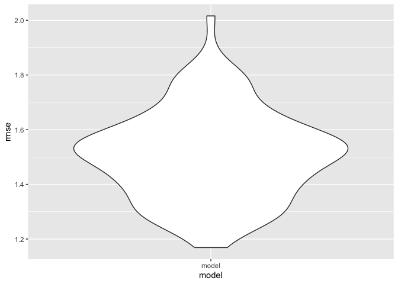

linear model
================
Xiaoyu Wu
2023-11-28

``` r
library(readxl)
library(dplyr)
```

    ## 
    ## Attaching package: 'dplyr'

    ## The following objects are masked from 'package:stats':
    ## 
    ##     filter, lag

    ## The following objects are masked from 'package:base':
    ## 
    ##     intersect, setdiff, setequal, union

``` r
library(ggplot2)
library(plotly)
```

    ## 
    ## Attaching package: 'plotly'

    ## The following object is masked from 'package:ggplot2':
    ## 
    ##     last_plot

    ## The following object is masked from 'package:stats':
    ## 
    ##     filter

    ## The following object is masked from 'package:graphics':
    ## 
    ##     layout

``` r
library(modelr)
library(purrr)
library(tidyr)
```

## Import the Data

``` r
file_path = "./PL_1819_data.xlsx"


player_df = read_excel(file_path, sheet = 4)
```

    ## New names:
    ## • `Gls` -> `Gls...12`
    ## • `Ast` -> `Ast...13`
    ## • `G+A` -> `G+A...14`
    ## • `G-PK` -> `G-PK...15`
    ## • `xG` -> `xG...20`
    ## • `npxG` -> `npxG...21`
    ## • `xAG` -> `xAG...22`
    ## • `npxG+xAG` -> `npxG+xAG...23`
    ## • `Gls` -> `Gls...27`
    ## • `Ast` -> `Ast...28`
    ## • `G+A` -> `G+A...29`
    ## • `G-PK` -> `G-PK...30`
    ## • `xG` -> `xG...32`
    ## • `xAG` -> `xAG...33`
    ## • `npxG` -> `npxG...35`
    ## • `npxG+xAG` -> `npxG+xAG...36`

## Data Wrangling

``` r
cleaned_player_df = player_df  |> 
 mutate(Age = as.numeric(as.character(Age)),
 Min = as.numeric(as.character(Min)))  |> 
 na.omit()
```

    ## Warning: There were 2 warnings in `mutate()`.
    ## The first warning was:
    ## ℹ In argument: `Age = as.numeric(as.character(Age))`.
    ## Caused by warning:
    ## ! NAs introduced by coercion
    ## ℹ Run `dplyr::last_dplyr_warnings()` to see the 1 remaining warning.

## Perform Correlation Analysis

``` r
correlation_result = cor.test(cleaned_player_df$Age, cleaned_player_df$Min)

# Printing the results
print(correlation_result)
```

    ## 
    ##  Pearson's product-moment correlation
    ## 
    ## data:  cleaned_player_df$Age and cleaned_player_df$Min
    ## t = 3.1142, df = 505, p-value = 0.001949
    ## alternative hypothesis: true correlation is not equal to 0
    ## 95 percent confidence interval:
    ##  0.05079301 0.22170090
    ## sample estimates:
    ##       cor 
    ## 0.1372684

#### Discussion

The Pearson correlation coefficient between Age (independent variable)
and Minutes Played (dependent variable) is approximately 0.137, with a
p-value of about 0.0019.

This correlation coefficient suggests a slight positive association
between Age and Minutes Played, meaning that as Age increases, there is
a slight tendency for Minutes Played to also increase. However, the
correlation is relatively weak.

The p-value indicates that this association is statistically
significant, assuming a conventional significance level (e.g., 0.05).
This means that the observed association is unlikely to be due to random
chance.

## Try to Transform Min into log(Min) for fitting linear model

``` r
cleaned_player_df$logMin = log(cleaned_player_df$Min)

model = lm(logMin ~ Age, data = cleaned_player_df)

summary(model)
```

    ## 
    ## Call:
    ## lm(formula = logMin ~ Age, data = cleaned_player_df)
    ## 
    ## Residuals:
    ##     Min      1Q  Median      3Q     Max 
    ## -6.8683 -0.4965  0.4957  1.0029  1.8265 
    ## 
    ## Coefficients:
    ##             Estimate Std. Error t value Pr(>|t|)    
    ## (Intercept)  4.72975    0.43504  10.872  < 2e-16 ***
    ## Age          0.07638    0.01661   4.598 5.39e-06 ***
    ## ---
    ## Signif. codes:  0 '***' 0.001 '**' 0.01 '*' 0.05 '.' 0.1 ' ' 1
    ## 
    ## Residual standard error: 1.532 on 505 degrees of freedom
    ## Multiple R-squared:  0.04019,    Adjusted R-squared:  0.03829 
    ## F-statistic: 21.14 on 1 and 505 DF,  p-value: 5.39e-06

``` r
# Optional: To visualize the model, you can create a scatterplot with the regression line
ggplot(cleaned_player_df, aes(x = Age, y = logMin)) +
  geom_point() +
  geom_smooth(method = "lm", se = FALSE) +
  ggtitle("Scatterplot of Age vs log(Min) with Linear Model") +
  xlab("Age") +
  ylab("log(Minutes Played)") +
  theme_minimal()
```

    ## `geom_smooth()` using formula = 'y ~ x'

<!-- -->

## Cross Validation

``` r
cv_df = 
  crossv_mc(cleaned_player_df, 100)

cv_df =
  cv_df |> 
  mutate(
    train = map(train, as_tibble),
    test = map(test, as_tibble))

cv_df = 
  cv_df |> 
  mutate(
    model  = map(train, \(cleaned_player_df) lm(logMin ~ Age, data = cleaned_player_df))
    ) |> 
  mutate(
    rmse_model = map2_dbl(model, test, \(model, cleaned_player_df) rmse(model = model, data = cleaned_player_df)))

cv_df |> 
  select(starts_with("rmse")) |> 
  pivot_longer(
    everything(),
    names_to = "model", 
    values_to = "rmse",
    names_prefix = "rmse_") |> 
  ggplot(aes(x = model, y = rmse)) + geom_violin()
```

<!-- -->
